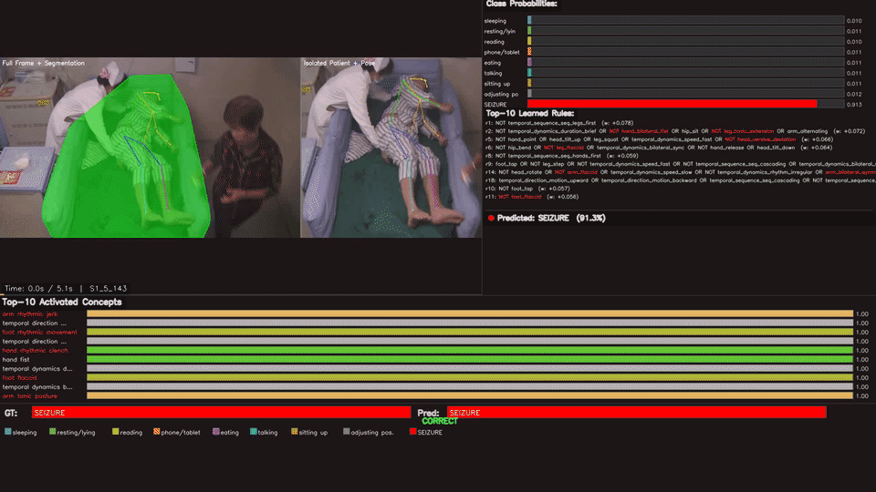
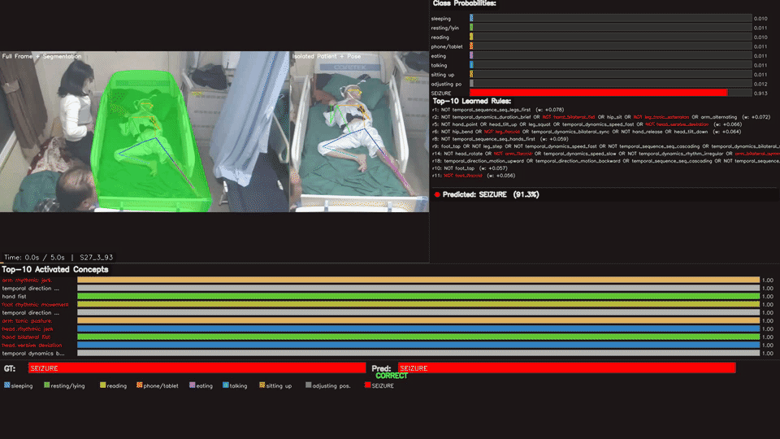
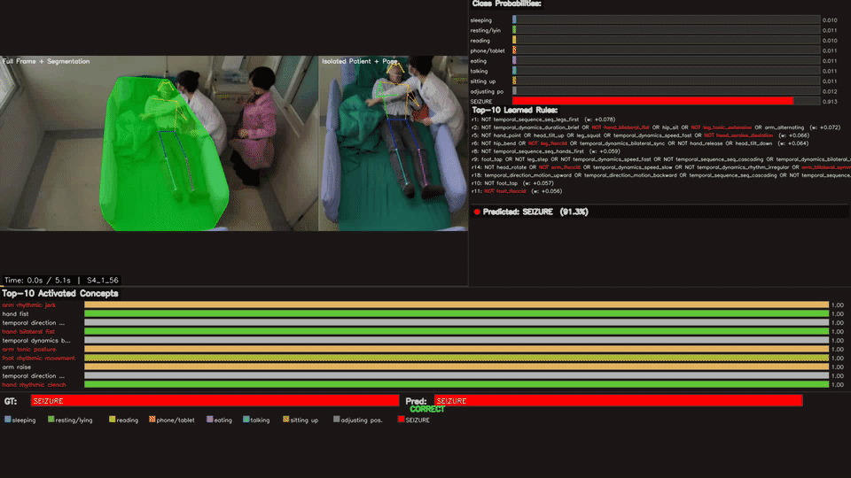
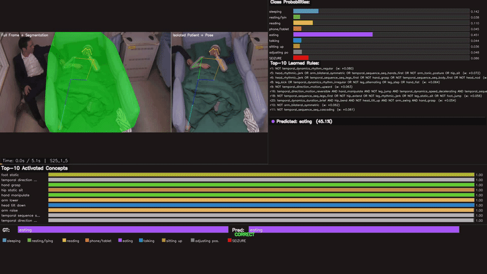
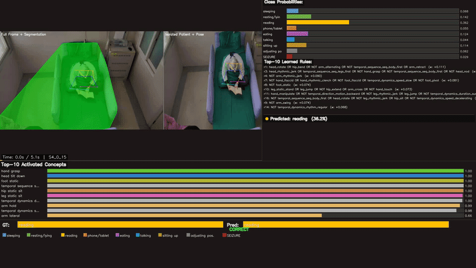
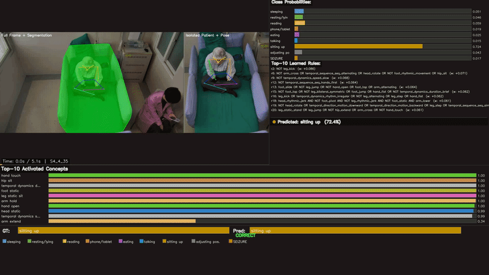

# A Neurosymbolic Framework for Interpretable Skeleton-Based Seizure Detection via Concept-Driven Logical Reasoning

<!-- Badges -->
<p align="center">
  <!---->
  
  
  
  
  
</p>

---

## Qualitative Visualizations

### IEEE Dataset

#### Seizure

<table>
  <tr>
    <td align="center">
      <br/>
      <sub><b>seizure_S1_5_143</b></sub><br/>
      <a href="https://drive.google.com/drive/folders/19hLbKzLx_UGB7jZay8Zdzhpe8gQoB5FA?usp=sharing">Full Video</a>
    </td>
    <td align="center">
      <br/>
      <sub><b>seizure_S27_3_93</b></sub><br/>
      <a href="https://drive.google.com/drive/folders/19hLbKzLx_UGB7jZay8Zdzhpe8gQoB5FA?usp=sharing">Full Video</a>
    </td>
    <td align="center">
      <br/>
      <sub><b>seizure_S4_1_56</b></sub><br/>
      <a href="https://drive.google.com/drive/folders/19hLbKzLx_UGB7jZay8Zdzhpe8gQoB5FA?usp=sharing">Full Video</a>
    </td>
  </tr>
</table>

#### Non-Seizure Activities

<table>
  <tr>
    <td align="center">
      <br/>
      <sub><b>Eating — eating_S25_1_5</b></sub><br/>
      <a href="https://drive.google.com/drive/folders/19hLbKzLx_UGB7jZay8Zdzhpe8gQoB5FA?usp=sharing">Full Video</a>
    </td>
    <td align="center">
      <br/>
      <sub><b>Reading — reading_S4_0_15</b></sub><br/>
      <a href="https://drive.google.com/drive/folders/19hLbKzLx_UGB7jZay8Zdzhpe8gQoB5FA?usp=sharing">Full Video</a>
    </td>
    <td align="center">
      <br/>
      <sub><b>Sitting — sitting_S4_4_35</b></sub><br/>
      <a href="https://drive.google.com/drive/folders/19hLbKzLx_UGB7jZay8Zdzhpe8gQoB5FA?usp=sharing">Full Video</a>
    </td>
  </tr>
</table>

### VSVIG (SAHZU) Dataset

<table>
  <tr>
    <td align="center">
      <br/>
      <sub><b>eating_seizure_pat11_029_Sz3P</b></sub><br/>
      Labels: <code>Eating</code> · <code>Seizure</code><br/>
      <a href="https://drive.google.com/drive/folders/1P0gf5QEl14mK8-7pXD0G2goWXv9enZky?usp=sharing">Full Video</a>
    </td>
    <td align="center">
      <br/>
      <sub><b>resting_seizure_pat10_025_Sz1P</b></sub><br/>
      Labels: <code>Resting</code> · <code>Seizure</code><br/>
      <a href="https://drive.google.com/drive/folders/1P0gf5QEl14mK8-7pXD0G2goWXv9enZky?usp=sharing">Full Video</a>
    </td>
    <td align="center">
      <br/>
      <sub><b>using_phone_resting_seizure_pat07_017_Sz1PG</b></sub><br/>
      Labels: <code>Using Phone</code> · <code>Resting</code> · <code>Seizure</code><br/>
      <a href="https://drive.google.com/drive/folders/1P0gf5QEl14mK8-7pXD0G2goWXv9enZky?usp=sharing">Full Video</a>
    </td>
  </tr>
</table>

---
## Abstract

Video-based seizure detection is essential for the management of epilepsy patients, offering a non-invasive complement to electroencephalography. While several deep learning approaches have been developed for video-based seizure detection, none are inherently interpretable, limiting their adoption and translation into clinical practice. We present, to our knowledge, the first exploration of a neurosymbolic framework for video-based seizure detection that directly addresses this gap. Our approach **(1)** extracts patient-centric skeleton sequences from epilepsy monitoring units via a prompt-guided foundation model, **(2)** predicts seizure semiology clinically grounded spatio-temporal concepts, and **(3)** composes them via differentiable logic into interpretable Boolean rules with auditable contributions. Furthermore, to mitigate false positives arising from the traditional binary formulation (seizure vs. non-seizure), we sub-classify non-seizure segments into clinically relevant normal activities, providing the model with fine-grained discriminative supervision. Evaluated on two public seizure video benchmarks, our framework achieves **89.78% sensitivity with 0.06 false detections per hour on SAHZU** and **85.27% / 0.09 on IEEE**, while producing complete three-level interpretability: every prediction decomposes into *which* motor primitives were detected, *how* they were logically composed, and *how much* each rule contributed to the clinical decision. We publicly release all annotations, extracted pose sequences, our data pipeline and code.

---
## Pipeline Overview

The full pipeline goes from raw EMU (Epilepsy Monitoring Unit) video to interpretable seizure predictions in **four stages**:

```
  Raw EMU Video
       │
       ▼
 ┌─────────────────────────────┐
 │  1. Patient Tracking &      │   SAM3 (text-prompted segmentation)
 │     Pose Extraction         │   + Sapiens 2B (pose estimation)
 │     patient_tracker/        │   → 17 COCO keypoints per frame
 └────────────┬────────────────┘
              │
              ▼
 ┌─────────────────────────────┐
 │  2. Activity Labelling      │   Qwen3-VL-8B VLM classifier
 │     vlm_assisted_labeller/  │   → frame-level action labels
 └────────────┬────────────────┘
              │
              ▼
 ┌─────────────────────────────┐
 │  3. Data Preparation        │   Skeleton normalization,
 │     prepare_training_data/  │   windowing, train/test split
 └────────────┬────────────────┘   → .npz datasets
              │
              ▼
 ┌─────────────────────────────┐
 │  4. Training & Evaluation   │   HyperGCN encoder → Concept
 │     training_scripts/       │   Predictors → Differentiable
 └─────────────────────────────┘   Logic Layers → Interpretable Rules
```

---

## Repository Structure

```
CDSD/
├── README.md                      ← You are here
│
├── patient_tracker/               # Stage 1: SAM3 tracking + Sapiens pose extraction
│   ├── pipeline.py                #   Main processing pipeline
│   ├── sapiens_pose.py            #   Sapiens 2B pose estimator
│   ├── run.py                     #   Quick-start runner
│   ├── requirements.txt
│   └── README.md                  #   ➜ Detailed tracking docs
│
├── vlm_assisted_labeller/         # Stage 2: VLM-based activity labelling
│   ├── pipeline.py                #   Labelling pipeline
│   ├── vlm_classifier.py          #   Qwen3-VL inference module
│   ├── config.py                  #   Action classes & prompts
│   ├── requirements.txt
│   └── README.md                  #   ➜ Detailed labelling docs
│
├── prepare_training_data/         # Stage 3: Dataset preparation
│   ├── prepare_ieee_dataset.py    #   IEEE dataset builder
│   ├── prepare_vsvig_dataset.py   #   VSVIG (SAHZU) dataset builder
│   ├── prepare_custom_dataset.py  #   Generic skeleton processing
│   └── ctrgcn_processing/         #   NTU-RGBD pre-training data prep
│       └── README.md              #   ➜ CTR-GCN processing docs
│
├── training_scripts/              # Stage 4: Model training & evaluation
│   ├── main_ieee.py               #   Train on IEEE dataset
│   ├── main_vsvig.py              #   Train on VSVIG dataset
│   ├── main_supervised_noLogic.py #   Ablation: no logic layers
│   ├── rule_extraction.py         #   Extract & visualize learned rules
│   ├── concepts/                  #   Concept-bottleneck annotations (CSV)
│   ├── config/szr/                #   Training configs (YAML)
│   ├── model/                     #   Model definitions
│   │   ├── model_sup_logic.py     #     Full neurosymbolic model
│   │   └── crl/                   #     Concept Reasoning Layers
│   ├── hgcn/                      #   HyperGCN backbone
│   ├── feeders/                   #   Dataset loaders
│   ├── graph/                     #   Graph topology definitions
│   └── visualization/             #   Qualitative evaluation scripts
│
├── data/                          # Processed datasets & download links
│   └── README.md                  #   ➜ Data download instructions
│
├── weights/                       # Pre-trained model weights
│   └── README.md                  #   ➜ Weight download links
│
└── viz/                           # Qualitative result GIFs
    ├── ieee/                      #   IEEE dataset visualizations
    └── vsvig/                     #   VSVIG dataset visualizations
```

---

## Getting Started

### Prerequisites

- Python 3.10+
- CUDA-capable GPU (16 GB+ VRAM recommended)
- [Conda](https://docs.conda.io/) (recommended) or virtualenv

### 1. Clone & Setup Environment

```bash
git clone <repo-url> CDSD && cd CDSD
conda create -n cdsd python=3.10 -y && conda activate cdsd
```

### 2. Download Weights

See [`weights/README.md`](weights/README.md) for all download links. You will need:

| Component | Model | Source |
|-----------|-------|--------|
| Patient segmentation | SAM3 | [HuggingFace](https://huggingface.co/facebook/sam3/resolve/main/sam3.pt?download=true) |
| Pose estimation | Sapiens 2B (TorchScript) | [HuggingFace](https://huggingface.co/noahcao/sapiens-pose-coco/tree/main/sapiens_lite_host/torchscript/pose/checkpoints/sapiens_2b) |
| Activity labelling | Qwen3-VL-8B-Instruct | [HuggingFace](https://huggingface.co/Qwen/Qwen3-VL-8B-Instruct) |
| GCN backbone | HyperGCN-L (NTU-120 pre-trained) | [Google Drive](https://drive.google.com/drive/folders/1d-lMPezFwttaNQmMyg89WEzeSIsW-T0D?usp=sharing) |

### 3. Download Data

See [`data/README.md`](data/README.md) for full instructions.

| Dataset | Description | Link |
|---------|-------------|------|
| Processed (training-ready) | `.npz` skeleton sequences | [Google Drive](https://drive.google.com/drive/folders/1tZEQVVN304sgnBYwWPV6lh482OMd9vSx?usp=sharing) |
| Raw extracted poses | `.npy` keypoint files | [Google Drive](https://drive.google.com/drive/folders/1kqV1vkW_iEtXO_c6vxC26F1e6FNeHW-W?usp=sharing) |
| VSVIG raw videos | Hospital EMU recordings | [HuggingFace](https://huggingface.co/datasets/xuyankun/WU-SAHZU-EMU-Video/tree/main) |
| IEEE raw videos | Seizure video dataset | [IEEE DataPort](https://ieee-dataport.org/documents/seizure-videos-epilepsy-patients) |

---

## Reproducing the Full Pipeline

### Stage 1 — Patient Tracking & Pose Extraction

> **Docs:** [`patient_tracker/README.md`](patient_tracker/README.md)

Extracts patient-centric skeleton sequences from raw EMU videos using SAM3 (text-prompted segmentation) and Sapiens 2B (17 COCO keypoints).

```bash
cd patient_tracker
pip install -r requirements.txt

# Process a single video
python run.py

# Or via Python API
python -c "
from pipeline import SeizureDetectionPipeline, PipelineConfig
config = PipelineConfig(weights_dir='../weights', output_dir='./output')
pipeline = SeizureDetectionPipeline(config)
pipeline.process_video('path/to/video.mp4')
"
```

**Output:** `.npy` files with keypoints of shape `(num_frames, 17, 3)` per video.

---

### Stage 2 — VLM-Assisted Activity Labelling

> **Docs:** [`vlm_assisted_labeller/README.md`](vlm_assisted_labeller/README.md)

Generates frame-level action labels for non-seizure segments using Qwen3-VL-8B-Instruct in a sliding-window approach.

```bash
cd vlm_assisted_labeller
pip install -r requirements.txt

python pipeline.py \
  --video-dir ../videos_raw/vids \
  --output-dir ../labels_output \
  --excel-path ../dataset_Label.xlsx
```

**9 Action Classes:**

| ID | Label | ID | Label |
|----|-------|----|-------|
| 0 | Sleeping | 5 | Eating |
| 1 | Resting / Lying down | 6 | Talking |
| 2 | Reading | 7 | Sitting up |
| 3 | Using phone / tablet | 8 | Seizure |
| 4 | Eating | | |

**Output:** Per-video `.npy` label arrays at 30 FPS + `label_map.json`.

---

### Stage 3 — Data Preparation

> **Docs:** [`prepare_training_data/`](prepare_training_data/)

Converts raw keypoints + labels into training-ready `.npz` datasets with COCO → NTU-25 skeleton conversion, normalization, and sliding-window segmentation.

```bash
cd prepare_training_data

# IEEE dataset
python prepare_ieee_dataset.py

# VSVIG dataset
python prepare_vsvig_dataset.py
```

**Output:** `ieee_seizure_dataset_overlap75.npz` and `vsvig_seizure_dataset_overlap50.npz` placed in `data/`.

---

### Stage 4 — Training & Evaluation

> **Docs:** [`training_scripts/`](training_scripts/)

The neurosymbolic model consists of:
1. **HyperGCN-L encoder** (pre-trained on NTU-RGBD 120) — skeleton → 512-d features
2. **Concept predictor** (`fc`) — 512-d → 95 clinically grounded concepts (72 spatial + 23 temporal)
3. **Differentiable logic layers** (CRL) — concepts → 9 action classes via Boolean rules

```bash
cd training_scripts

# Train on IEEE dataset
python main_ieee.py

# Train on VSVIG dataset
python main_vsvig.py

# Ablation: supervised baseline without logic layers
python main_supervised_noLogic.py
```

### Rule Extraction & Interpretability

After training, extract the learned Boolean rules:

```bash
cd training_scripts
python rule_extraction.py
```

This produces visualizations showing:
- **Level 1:** Which motor-primitive concepts activated for the input
- **Level 2:** How concepts were logically composed into rules
- **Level 3:** How much each rule contributed to the final prediction

---

## Acknowledgements

This project builds on the following open-source works:

- [SAM3](https://github.com/facebookresearch/sam3) — Segment Anything with Concepts (Meta AI)
- [Sapiens](https://github.com/facebookresearch/sapiens) — Foundation for Human Vision Models
- [Qwen3-VL](https://huggingface.co/Qwen/Qwen3-VL-8B-Instruct) — Vision-Language Model
- [HyperGCN](https://github.com/) — Hypergraph Convolutional Networks for skeleton action recognition
- [CRL](https://github.com/) — Concept Reasoning Layers for neurosymbolic learning

---

<p align="center">
  <i>For questions or issues, please open a GitHub issue.</i>
</p>


